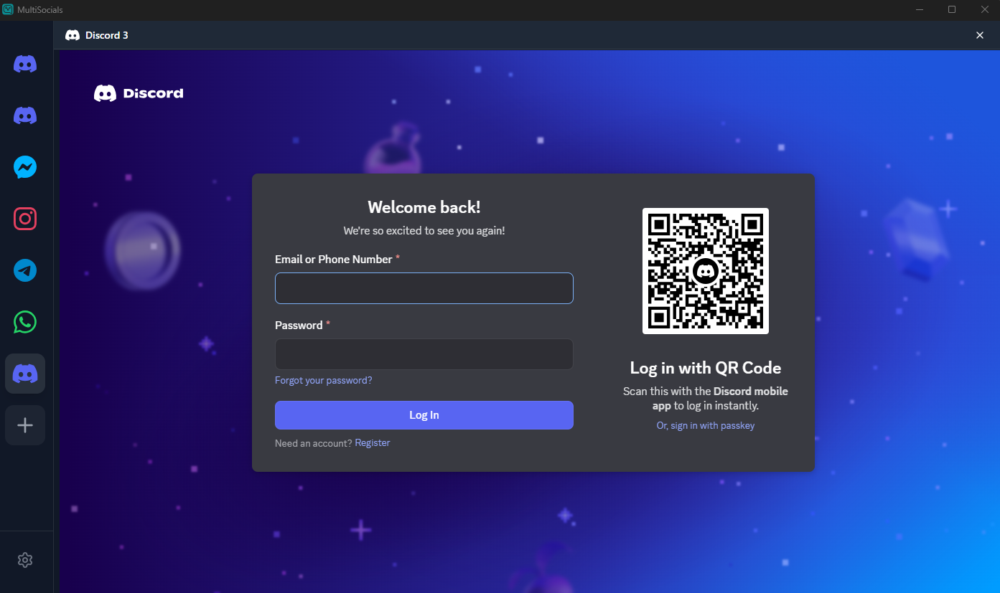
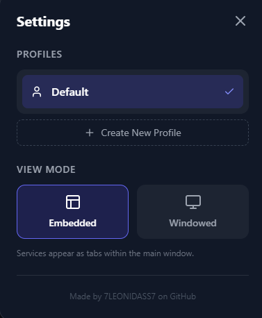

# MultiSocials

Desktop app for managing multiple social media accounts in one place.

## Download

**[⬇️ Download Latest Release](https://github.com/Vaixtrom/MultiSocials/releases/latest)**

### Windows
- `MultiSocials-Setup.exe`

> **Note:** Windows SmartScreen will warn you because the app is not code-signed. Click "More info" → "Run anyway" to install.

### macOS
- `MultiSocials.dmg`

> **Note:** On macOS, you may need to go to **System Settings** > **Privacy & Security** and scroll to the bottom to allow the app to open, as it is not code-signed by Apple.


## Screenshots


*Main window showing multiple services*



## What is this?

MultiSocials lets you run multiple instances of messaging apps simultaneously. Each service runs in its own isolated session, so you can stay logged into multiple accounts at the same time.

## Features

- **Multiple Accounts**: Add the same service multiple times (e.g., 3 Different Discord accounts)
- **Two View Modes**:
  - Embedded mode - all services in one window
  - Windowed mode - each service in its own window
- **Profiles**: Create different profiles for work, personal, etc.
- **Drag & Drop**: Reorder services in the sidebar
- **Session Isolation**: Each service runs independently with its own data

## Supported Services

- Discord
- WhatsApp
- Messenger
- Telegram
- Instagram

## Setup

```bash
# Install dependencies
npm install

# Run in dev mode
npm run tauri dev

# Build for production
npm run tauri build
```

## Requirements

- Node.js (v18+)
- Rust (latest stable)

---

Built with Tauri, React, and TypeScript
